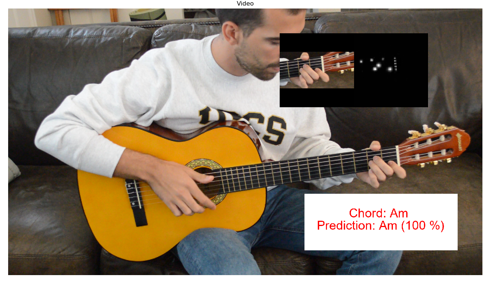

# Chord detection
This repo contains the code structure for the detection of guitar chords from input images.  
The dataset of this project is located in: https://github.com/LincLabUCCS/Albert

## Installation (Linux)

**Create conda environment**
```
$ conda create -n ENVIRONMENT_NAME python=3
$ conda activate ENVIRONMENT_NAME
$ conda config --add channels conda-forge
$ conda config --add channels pytorch
$ conda config --add channels bioconda
```

**Clone and install requirements**
```
$ git clone git@github.com:AlbertMitjans/chord-detection.git
$ cd chord-detection/
$ conda install --file requirements.txt
```
**Download pretrained weights**
```
$ cd checkpoints/
$ bash get_weights.sh
```
**Download dataset**
```
$ cd ..
$ cd data/
$ bash get_dataset.sh
```

## Hourglass network

### Run test

Evaluates the model on the dataset. The network outputs 3 heatmaps with the position of the detected frets, strings and fingers.

```
$ python3 main.py --train False --ckpt checkpoints/best_ckpt/MTL_hourglass.pth
```

As default, for every image, the input and the output are saved in the *output/* folder.

<p align="center">
  
  
  
</p>

**Testing log**
```
FINGERS:        Recall(%): 89.646       Precision(%): 96.970
FRETS:          Recall(%): 96.717       Precision(%): 100.000
STRINGS:        Recall(%): 89.380       Precision(%): 100.000
   
```

### Run train

Trains the pre-trained network from scratch or from a given checkpoint.

```
$ python3 main.py
```

**Training log**
```
Epoch: [0][10/172]      Loss.avg: 96.6020       Batch time: 0.4998 s    Total time: 0.3796 min
FINGERS:        Recall(%): 50.758       Precision(%): 95.455
FRETS:          Recall(%): 3.636        Precision(%): 0.308
STRINGS:        Recall(%): 1.515        Precision(%): 0.088
```

**Tensorboard**

Track training progress in Tensorboard:
+ Initialize training
+ Run the command below inside the chord-detection directory.
+ Go to [http://localhost:6006/](http://localhost:6006/)

```
$ tensorboard --logdir='logs' --port=6006
```

### Arguments
--train (default:True) : if True/False, training/testing is implemented.  
--val_data (default:True) : if True/False, all/validation data will be evaluated.  
--save_imgs (default:True) : if True output images will be saved in the \Output folder.  
--batch_size (default:1)  
--depth (default:True) : if True/False, depth/RGB images will be used.  
--ckpt(default:None)  
--num_epochs (default:200)  

## Chord detection

### Image detection

Detects the chords played in all the images of the dataset.

```
$ python3 detect.py --print_tab True --plot_imgs True
```

<p align="center">
  
  
  
</p>

**Image detection log**
```
image1.jpg:

Tablature:

[[0. 0. 0. 0. 1. 0.]
 [0. 0. 1. 0. 0. 0.]
 [0. 1. 0. 0. 0. 0.]
 [0. 0. 0. 0. 0. 0.]]

Target: C  ,  Prediction: C (100%)

Detection precision: 100.0%
```

#### Arguments
--folder (default:2) : choose image folder for the detection. The dataset contains three different folders (0, 1 or 2).  
--print_tab (default:False) : prints the tablature obtained from the detection.  
--plot_imgs (default:False) : plots images of the detection process.  
--conf_matrix (default:False) : creates and saves a confusion matrix of the detection of all the images.  

### Video

Detects the chords of every frame of a video of the dataset and saves the results as a new video.

```
$ python3 video.py --vid_number 1 --show_animation True
```

<p align="center">
  
</p>

#### Arguments
--vid_number (default:1) : number of the video to use for the detection. The dataset contains up to 21 different videos.  
--show_animation (default:True) : plots the saved frames during the detection process.


